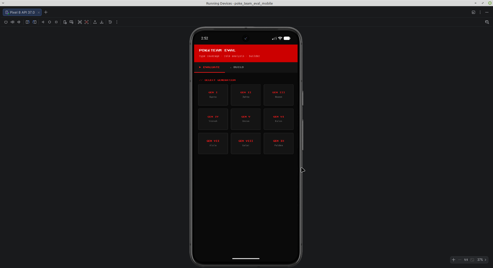
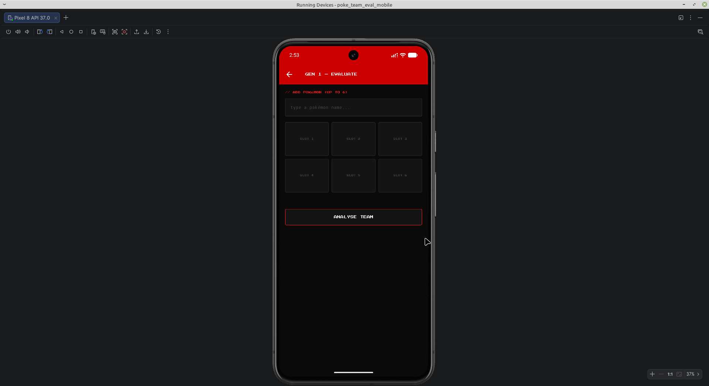
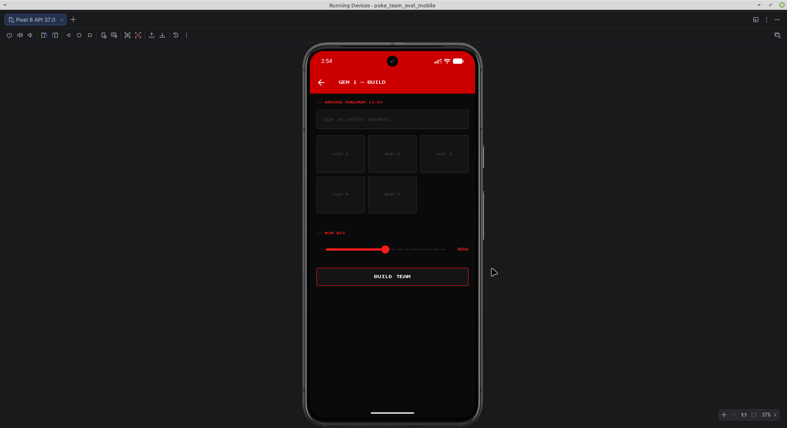

# 🔴 PokéTeam Eval — Android App

A Pokémon team analyser and builder for Generations I–IX, built with Flutter.
Companion app to the [PokéTeam Eval web tool](https://poke-team-eval.onrender.com).

---

## Features

- **Evaluate** a team of up to 6 Pokémon — type coverage, role distribution,
  stat summary, speed tiers, warnings
- **Build** a team around 1–5 anchor Pokémon using rule-based optimisation
- **BST filter** — control the minimum quality of suggested Pokémon
- **Generation I–IX** support with generation-accurate type charts
- **Key moves** shown per Pokémon using level-up learnset data
- **Pokédex dark theme** — consistent with the web app

---

## Screenshots

| Home | Evaluate | Results | Build |
|---|---|---|---|
|  |  |  |  |

---

## Architecture

The app is a **thin client** — all Pokémon logic runs on the
[Python backend](https://github.com/Besfort21/poke-team-eval).
The app handles input, API calls, and rendering only.

---

## Backend

All data and logic is served by the Python backend:
**`https://poke-team-eval.onrender.com`**

Endpoints used:
- `GET /api/pokemon/search` — autocomplete
- `POST /api/evaluate` — team evaluation
- `POST /api/build` — team builder
- `GET /api/generations` — server warm-up on launch

> The backend runs on Render's free tier and may take up to 50 seconds
> to respond after a period of inactivity. The app warms the server
> silently on launch to minimise this delay.

---

## Tech Stack

| Layer | Tool |
|---|---|
| Framework | Flutter 3.44 |
| Language | Dart |
| Platform | Android (API 21+) |
| HTTP | package:http |
| Fonts | Google Fonts (Press Start 2P, Share Tech Mono) |
| State | setState (local) |
| Backend | FastAPI on Render |

---

## Setup

**1. Clone the repo**
```bash
git clone https://github.com/Besfort21/poke-team-eval-mobile.git
cd poke_team_eval_mobile
```

**2. Install dependencies**
```bash
flutter pub get
```

**3. Run on emulator or device**
```bash
flutter run --release
```

> Requires Android emulator or physical Android device.
> Flutter SDK 3.44+ required.

---

## Related

- 🌐 **Web app:** https://poke-team-eval.onrender.com
- 🐍 **Backend repo:** https://github.com/Besfort21/poke-team-eval

---

## Roadmap

- [ ] Google Play Store release
- [ ] Regional forms (Alolan, Galarian, Hisuian)
- [ ] Offline mode — bundle data locally
- [ ] Saved teams
- [ ] Shareable team URLs

---

## Download

**[Download APK (v1.0.0)](https://github.com/Besfort21/poke-team-eval-mobile/releases/tag/v1.0.0)**

To install:
1. Download the APK on your Android device
2. Enable **Install from unknown sources** in Settings
3. Open the downloaded APK and install
